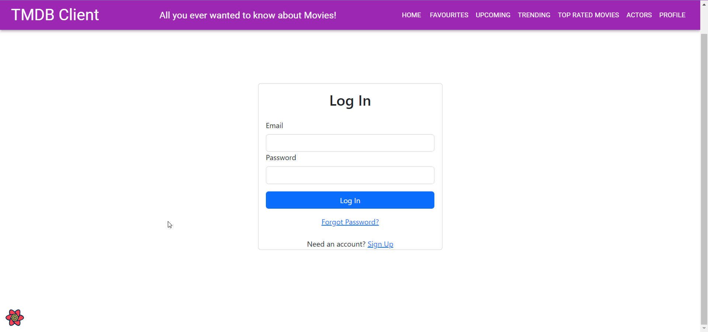
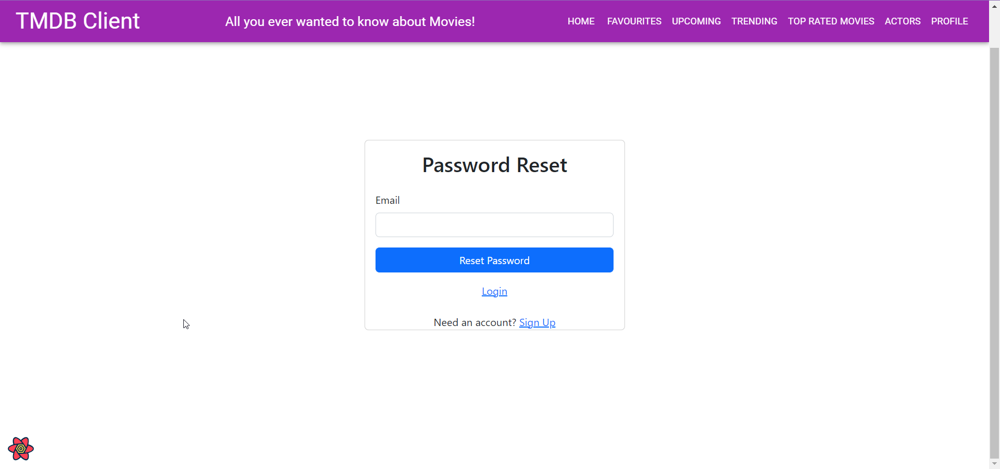
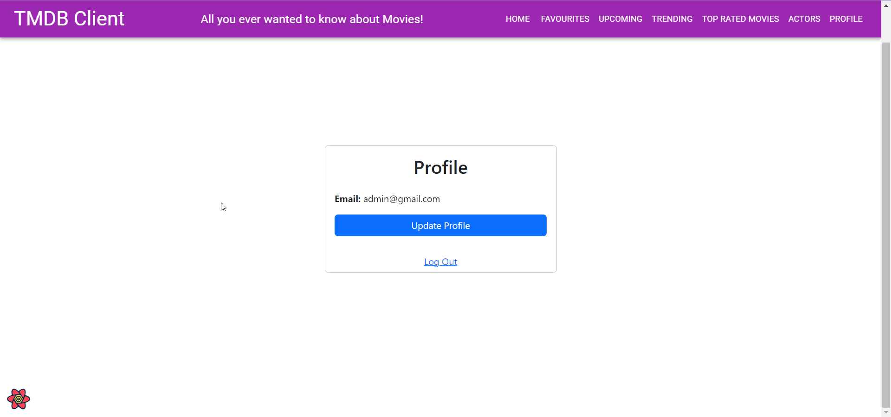
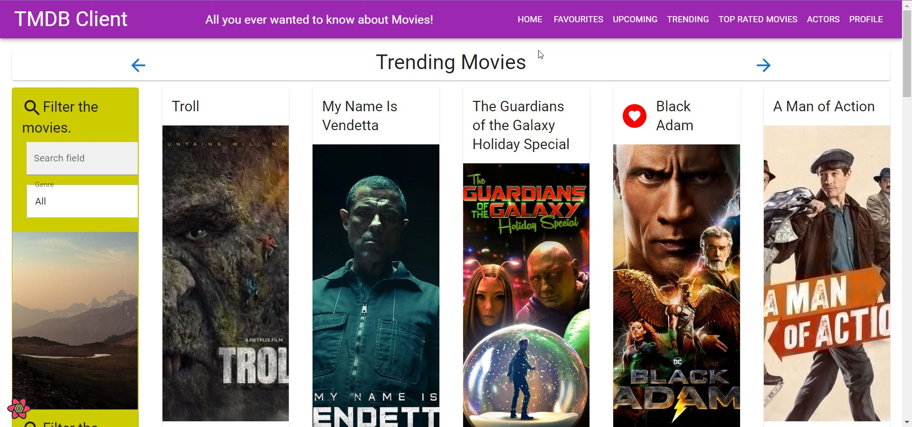
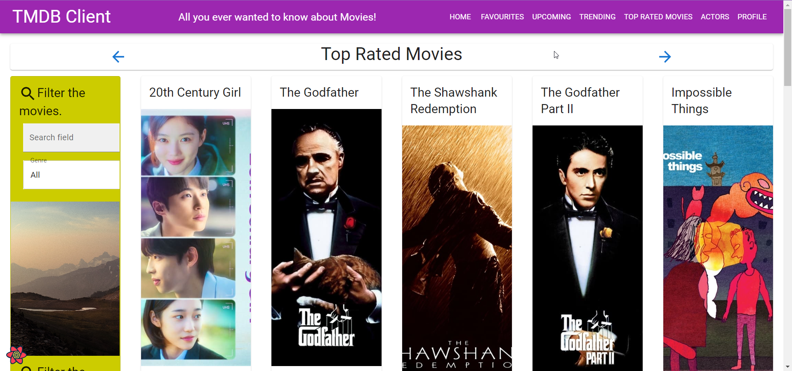

# Web App Dev 2 - Assignment 1 - ReactJS app.

Name: [Moses Ugwulo]

## Overview.

### New Pages.

+ Dashboard page
+ Actor page
+ Actor Details page
+ Trending movies page
+ Top rated movies page

### New Features.

+ Authentication (Using Firebase)
+ Password reset (Using Firebase)
+ Updating email (Using Firebase)

## Setup requirements.

```
$ npm install firebase
$ npm install react-router-dom
$ npm install react-bootstrap bootstrap
$ npm start
```

## TMDB endpoints.

+ /movies/{movie_id}/ - The movies details
+ /movies/{movie_id}/reviews - The user reviews or a movie. 
+ /movie/upcoming - A list of upcoming movies.
+ /trending/movie/day - A list of trending movies.
+ /movie/top_rated - A list of top rated movies.
+ /person/popular - A list of popular actors.
+ /person/{person_id} - The actor details.

## App Design.

### UI Design.



>Allows the user to log in to the app.


>Allows the user to create an account



>Allows the user to reset their password



>Allows the user to update their account details



>Shows the user all the trending movies



>Shows the user all the top rated movies


>Shows the user all the actors in the database


>Shows the user the details of an actor

### Routing.

| Route | Page | Aceess |
| --- | --- | --- |
| /login | Login | Public |
| /signup | Signup | Public |
| /forgot-password | Password Reset | Public |
| / | Dashboard | Protected |
| /movies | Movies | Protected |
| /movies/:id | Movie Details | Protected |
| /actors | Actors | Protected |
| /actors/:id | Actor Details | Protected |
| /trending | Trending | Protected |
| /top-rated | Top Rated | Protected |
## Independent learning (If relevant).

+ [Firebase Authentication](https://firebase.google.com/docs/auth)
+ [Private Routes](https://jasonwatmore.com/post/2022/06/24/react-router-6-private-route-component-to-restrict-access-to-protected-pages#:~:text=The%20react%20private%20route%20component,in%20the%20location%20state%20property.)
